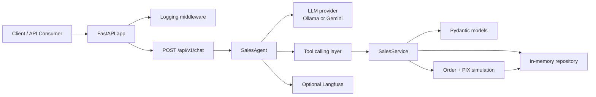

# LuizaLabs Sales Assistant Challenge

FastAPI conversational sales API with session memory, cart operations, simulated checkout, order status lookup, Docker-based execution, and a test suite designed to run entirely in containers.

## What this project does

- Exposes a single chat endpoint at `POST /api/v1/chat`.
- Keeps conversation state by `session_id`.
- Lets the agent manage a shopping cart through tool/function calls.
- Simulates checkout with an order ID and PIX copy/paste code.
- Returns only the assistant text in the API response payload.
- Runs unit, integration, lint, and coverage checks inside Docker.

## Architecture



### Component map

- `app/main.py` wires the FastAPI app and routes.
- `app/api/` contains request/response schemas, routes, and middleware.
- `app/agent.py` orchestrates the conversation and tool calls.
- `app/services.py` owns cart, order, and session logic.
- `app/models.py` defines domain entities and order status values.
- `app/repository.py` stores runtime state in memory.
- `tests/unit/` validates isolated behavior.
- `tests/integration/` validates API and service flows end to end.

## Services Overview

The `docker-compose.yml` defines the following services:

- **api**: FastAPI application exposing the chat endpoint.
- **redis**: In‑memory data store used for session and cache handling.
- **ollama**: Ollama server that hosts the LLM models.
- **ollama-pull-model**: Helper container that waits for Ollama to start and pulls the required model (`llama7b`).
- **langfuse-db**: PostgreSQL database for Langfuse telemetry data.
- **langfuse**: Langfuse service for observability of LLM calls (can be disabled via `TELEMETRY_ENABLED=false`).
- **prometheus**: Metrics collector scraping FastAPI, Ollama and other containers.
- **loki**: Log aggregation service.
- **promtail**: Agent that ships container logs to Loki.
- **grafana**: Dashboard for visualizing Prometheus metrics and Loki logs.

All services share persistent volumes defined at the bottom of the compose file:

- `redis-data` – Redis data persistence.
- `ollama-data` – Ollama model cache.
- `langfuse-db-data` – Langfuse PostgreSQL data.
- `app-logs` – Shared log directory mounted into `api` and `promtail`.

These services can be started with `docker compose up --build` and stopped with `docker compose down -v`.

- a conversational REST API built with FastAPI;
- integration with Google ADK;
- a single chat endpoint;
- session-based memory;
- cart management tools;
- checkout with PIX copy/paste;
- order status lookup;
- clean README instructions and architecture explanation.

This implementation covers those requirements with the following behavior:

- `POST /api/v1/chat` receives `session_id` and `message`.
- The agent keeps session history in memory.
- The service layer adds, removes, clears, and checks out cart items.
- Checkout creates an order ID and a PIX string.
- Order status returns `Processing`, `Shipped`, or `Order not found`.
- The response body is limited to the assistant reply payload.

## Requirements

- Docker
- Docker Compose
- `make` is optional but recommended

## Environment

Copy the example environment file:

```bash
cp .env.example .env
```

The project keeps only the environment variables currently used by the codebase. Update `.env` only if you change runtime settings.

## Run with Docker

Start the API:

```bash
make run
```

Or directly with Compose:

```bash
docker compose up --build
```

The API is available at `http://localhost:8000`.

## Run tests with Docker

All tests run inside the dedicated test container:

```bash
make test
```

Run coverage and keep the artifacts inside `tests/`:

```bash
make coverage
```

Generated coverage files:

- `tests/.coverage`
- `tests/coverage/html/`
- `tests/coverage/coverage.xml`

## Lint and quality checks

Run the project checks in Docker:

```bash
make lint
```

This executes:

- `ruff`
- `mypy`
- `black --check`
- `bandit`

## Useful Make targets

- `make run` starts the API container.
- `make test` runs the full test suite in Docker.
- `make coverage` runs tests with coverage output under `tests/`.
- `make lint` runs code quality checks in Docker.
- `make docker-up` starts the API in detached mode.
- `make docker-down` stops the running containers.
- `make docker-test` runs the test container workflow.

## Verify the API manually

Health check:

```bash
curl http://localhost:8000/health
```

Chat request:

```bash
curl -X POST http://localhost:8000/api/v1/chat \
  -H "Content-Type: application/json" \
  -d "{\"session_id\":\"demo\",\"message\":\"add a keyboard for 250\"}"
```

## Implementation notes

- Runtime state is in memory, which keeps the project simple and testable.
- The agent is built on Google ADK and supports Ollama by default or Gemini when configured.
- Gemini integration uses `google-genai`.
- Optional Langfuse telemetry is skipped when credentials are not present.
- Docker images are kept lean by installing only runtime dependencies in the app image and dev/test dependencies in the test image.

## Validation status

Current validation targets:

- unit and integration tests in Docker;
- coverage above 90%;
- lint and static checks in Docker;
- no coverage artifacts outside `tests/`.

If you change the code, rerun:

```bash
make coverage
make lint
```

Then confirm the `tests/coverage/` directory contains the generated reports and the repository root stays clean.
