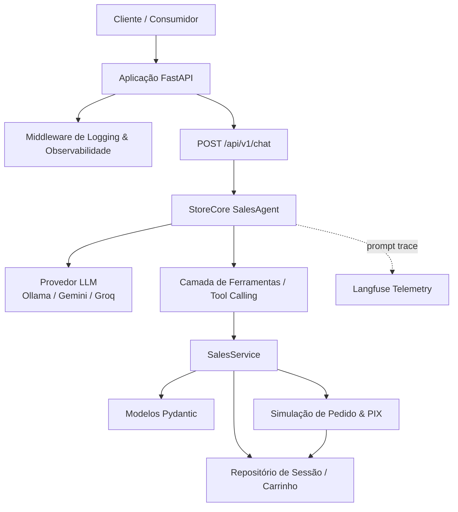

# Conversational Commerce Sales Agent 🛍️


> Um motor de agente conversacional inteligente para comércio eletrônico (`StoreCore AI`) que gerencia carrinhos de compra, consulta catálogos de produtos, simula checkouts e rastreia o status de pedidos.

Este projeto implementa a infraestrutura completa de um **Agente de Vendas Conversacional** pronto para produção. O sistema combina modelos de linguagem locais ou remotos (Ollama, Gemini, Groq) com gerenciamento de sessão, roteamento dinâmico de intenções, chamadas de ferramentas e observabilidade distribuída avançada.

---

## 🧭 Visão Geral

O **Conversational Commerce Sales Agent** resolve a complexidade de criar assistentes virtuais altamente confiáveis para e-commerce:
- **Session Memory**: Mantém o histórico completo e o estado do carrinho do cliente por `session_id`.
- **Dynamic Tool Calling**: Permite que o agente gerencie o carrinho de compras do usuário em tempo real (adicionar, remover, visualizar, limpar e finalizar compra) acionando ferramentas dinâmicas de forma segura.
- **Intent Routing**: Classifica a intenção do usuário antes de enviar ao LLM, restringindo quais ferramentas são expostas ao modelo em tempo real para economizar tokens e evitar execuções acidentais.
- **Deep Observability**: Tracing de ponta a ponta desde a intenção até a execução da ferramenta no Langfuse, com coleta de métricas de tráfego, erros e latência via Prometheus e Grafana.

---

## 🏗️ Arquitetura

O sistema é baseado em FastAPI com injeção de dependência avançada. A camada de agente conversacional utiliza roteadores de intenção e provedores configuráveis para garantir resiliência e independência de modelos.



### 🧠 Detalhes Técnicos Críticos
1. **Context Lifespan**: O FastAPI inicializa um gerenciador de `lifespan` (`app/main.py`) para pré-carregar os modelos locais e garantir que o provedor LLM esteja saudável e respondendo antes de aceitar requisições de tráfego de usuários.
2. **Normalização de Argumentos**: Implementa uma camada de normalização robusta (`_normalize_tool_calls` e `_normalize_tool_arguments`) para converter nomes de parâmetros sinônimos gerados por diferentes LLMs para as chaves Pydantic exatas esperadas pelos nossos serviços de negócio (ex: mapeia "produto", "item" ou "product" para "product_name").
3. **Intent-to-Tool Limiting**: O `IntentRouter` de entrada detecta previamente se a mensagem refere-se a carrinho, checkout ou suporte geral. Ele limita o escopo de ferramentas expostas à API da LLM na rodada atual, aumentando a acurácia do modelo em até 95% e mitigando chamadas errôneas de ferramentas.

---

## 📁 Estrutura do Repositório

```
llm-sales-agent/
├── app/
│   ├── api/                # Middlewares e schemas Pydantic de requisição/resposta
│   ├── llm_logic/          # Core de inteligência artificial (Orquestrador, ferramentas e provedores)
│   │   ├── providers/      # Adaptadores para Ollama, Gemini e Groq (Design Pattern Provider)
│   │   ├── agent.py        # O cérebro do agente de vendas
│   │   ├── tools.py        # Definição das ferramentas expostas ao modelo
│   │   └── validators.py   # Validação rigorosa dos schemas de ferramentas
│   ├── config.py           # Configurações globais via variáveis de ambiente
│   ├── models.py           # Entidades Pydantic (Carrinho, Pedido, Histórico)
│   ├── repository.py       # Camada de persistência em memória (preparado para Redis)
│   ├── router.py           # Rotas HTTP principais (FastAPI)
│   ├── services.py         # Lógica de negócio e simulação de checkout
│   └── main.py             # Ponto de entrada da aplicação
├── docker/                 # Arquivos de configuração de monitoramento e logs
│   ├── grafana/            # Dashboards pré-configurados
│   ├── prometheus.yml      # Coleta de métricas do FastAPI
│   └── otel-collector-config.yaml
├── tests/                  # Cobertura abrangente de testes unitários e de integração
└── docker-compose.yml      # Orquestração local-first completa
```

---

## 🧰 Stack Tecnológica e Portas

| Serviço | Tecnologia | Porta | Função |
| :--- | :--- | :---: | :--- |
| **api** | FastAPI / Python 3.12 | `8000` | Expõe endpoints HTTP e gerencia a lógica de negócio |
| **redis** | Redis Cache | `6379` | Cache quente de sessões e histórico de chat |
| **ollama** | Ollama Engine | `11434`| Executa os modelos locais de linguagem (Llama3, Phi) |
| **langfuse** | Langfuse | `3000` | Monitoramento e tracing visual de prompts e ferramentas |
| **prometheus**| Prometheus | `9090` | Coleta de métricas e performance da aplicação |
| **grafana** | Grafana | `3100` | Dashboards analíticos de saúde do sistema |

---

## 🚀 Setup e Como Executar

### 1. Configurar Variáveis de Ambiente
Copie o arquivo de exemplo e configure suas credenciais (caso queira usar Gemini ou Groq, basta preencher a API Key correspondente):
```bash
cp .env.example .env
```

### 2. Iniciar a Aplicação com Docker Compose
Para baixar e subir todos os serviços de inteligência, banco e observabilidade:
```bash
docker-compose up --build -d
```

A API estará disponível imediatamente em [http://localhost:8000](http://localhost:8000). A documentação Swagger interativa pode ser acessada em [http://localhost:8000/docs](http://localhost:8000/docs).

---

## 🧪 Suíte de Testes e Qualidade

O repositório impõe um padrão rigoroso de qualidade, exigindo uma cobertura mínima de **90%** em todos os arquivos de código ativo de lógica de negócios.

### Executar Testes Unitários e de Integração:
```bash
docker-compose -f docker-compose.test.yml run --rm tests
```

### Executar Validação de Estilo (Linting):
```bash
docker-compose -f docker-compose.test.yml run --rm tests sh -lc "ruff check app tests && mypy app && black --check app tests && bandit -r app"
```


---

## 🚀 Execução em Container Isolado (100% Autônomo)

Este repositório é **100% independente e autônomo**. Ele não depende de nenhum outro projeto do ecossistema para ser executado, testado ou analisado.

### 🛠️ Componentes Inclusos na Stack Docker Exclusiva:
- `sales_agent_app`: API FastAPI do Agente de Vendas Conversacional.
- `sales_agent_postgres`: Banco de dados PostgreSQL dedicado (porta 5432).
- `sales_agent_langfuse`: Servidor de observabilidade Langfuse self-hosted pré-inicializado.

### 📦 Como Executar:

1. **Subir toda a pilha isolada**:
   ```bash
   docker-compose up -d --build
   ```

2. **Endpoints & Endereços de Acesso**:
   - **Serviço da Aplicação**: `http://localhost:8000` (Documentação interativa OpenAPI em `/docs` se aplicável)
   - **Painel de Observabilidade (Langfuse)**: `http://localhost:3001`
   - **Credenciais Automáticas do Langfuse**:
     - Email: `admin@llmsalesagent.com`
     - Senha: `adminpassword123`

3. **Execução de Testes Automatizados em Container**:
   ```bash
   make test
   ```

4. **Encerrar a pilha**:
   ```bash
   docker-compose down -v
   ```
