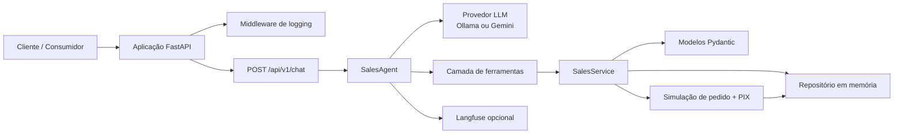

# Desafio LuizaLabs Sales Assistant

API conversacional de vendas em FastAPI com memória de sessão, operações de carrinho, checkout simulado, consulta de status de pedido, execução via Docker e uma suíte de testes projetada para rodar totalmente em containers.

## O que este projeto faz

- Expõe um único endpoint de chat em `POST /api/v1/chat`.
- Mantém o estado da conversa por `session_id`.
- Permite que o agente gerencie o carrinho de compras por meio de chamadas de ferramentas/funções.
- Simula o checkout com um ID de pedido e código PIX para copiar e colar.
- Retorna apenas o texto do assistente no payload da resposta da API.
- Executa testes unitários, de integração, lint e coverage dentro do Docker.

## Arquitetura

O sistema é baseado em FastAPI com injeção de dependência e gerenciamento de estado via um repositório abstrato (em memória para o desafio). O agente de vendas utiliza modelos LLM (Ollama ou Gemini) para entender intenções e invocar ferramentas.

### Detalhes técnicos importantes

- **Startup**: A aplicação utiliza um contexto gerenciador de `lifespan` (`app/main.py`) para garantir que o LLM (se for Ollama) esteja disponível e com o modelo carregado antes de aceitar requisições.
- **Ferramentas**: As ferramentas são definidas dinamicamente (`app/agent.py`) e validadas por schemas Pydantic.
- **Roteamento de intenção**: Existe uma camada de `IntentRouter` para classificar o que o usuário deseja e restringir quais ferramentas são expostas ao LLM em tempo real, otimizando o uso do contexto.
- **Normalização**: O agente realiza uma etapa de normalização (`_normalize_tool_calls` e `_normalize_tool_arguments`) para converter nomes de campos variáveis da LLM para os campos esperados pelo `SalesService` (ex: "produto" ou "item" para "product_name").

### Mapa de componentes

- `app/main.py`: Ponto de entrada, configuração do FastAPI, gerenciamento de `lifespan`, rotas principais e Instrumentação Prometheus.
- `app/api/`: Middlewares, schemas Pydantic (`ChatRequest`, `ChatResponse`).
- `app/llm_logic/`:
    - `agent.py`: O "cérebro" do sistema. Orquestra LLMs, gerencia histórico de chat, aplica ferramentas e valida argumentos.
    - `tools.py`: Definições das ferramentas disponíveis.
    - `validators.py`: Validação das chamadas de ferramentas e campos obrigatórios.
    - `providers/`: Implementações dos provedores LLM (`gemini.py`, `groq.py`, `ollama.py`, `base.py`).
- `app/services.py`: Lógica de negócio (adicionar/remover do carrinho, finalizar compra).
- `app/models.py`: Modelos de dados Pydantic (`Cart`, `Order`, `ConversationSession`).
- `app/repository.py`: Camada de persistência (implementação em memória padrão, mas estruturada para suportar Redis).
- `tests/`: Suíte completa de testes.

## Serviços no Docker Compose

O `docker-compose.yml` define a infraestrutura completa de observabilidade e execução:

- **api**: Aplicação FastAPI.
- **redis**: Armazenamento de sessão (atualmente em memória no código, mas a infra está pronta).
- **ollama**: Servidor de modelos LLM.
- **ollama-pull-model**: Container de setup do modelo.
- **langfuse-db & langfuse**: Telemetria para rastreamento de uso de LLM.
- **prometheus, loki, promtail, grafana**: Stack de observabilidade para métricas e logs.

## Requisitos

- Docker
- Docker Compose
- `make` (recomendado)

## Como executar

1. Copie o arquivo de ambiente: `cp .env.example .env`
2. Inicie a API: `make run`
3. A API fica disponível em `http://localhost:8000`.

## Testes e Cobertura

O projeto exige **cobertura mínima de 90%**.

- Executar testes: `make test`
- Executar com cobertura: `make coverage`

A configuração está no `pyproject.toml` ( `tool.pytest.ini_options` ).

## Lint e qualidade

- Executar: `make lint` (executa `ruff`, `mypy`, `black`, `bandit`).
