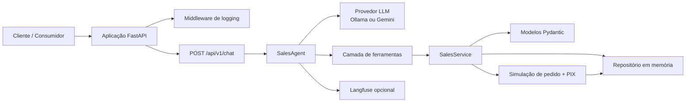

# Desafio LuizaLabs Sales Assistant

API conversacional de vendas em FastAPI com memória de sessão, operações de carrinho, checkout simulado, consulta de status de pedido, execução via Docker e uma suíte de testes projetada para rodar totalmente em containers.

## O que este projeto faz

- Expõe um único endpoint de chat em `POST /api/v1/chat`.
- Mantém o estado da conversa por `session_id`.
- Permite que o agente gerencie o carrinho de compras por meio de chamadas de ferramentas/funções.
- Simula o checkout com um ID de pedido e código PIX para copiar e colar.
- Retorna apenas o texto do assistente no payload da resposta da API.
- Executa testes unitários, de integração, lint e coverage dentro do Docker.

## Arquitetura



### Mapa de componentes

- `app/main.py` conecta a aplicação FastAPI e as rotas.
- `app/api/` contém schemas de requisição/resposta, rotas e middleware.
- `app/agent.py` orquestra a conversa e as chamadas de ferramentas.
- `app/services.py` gerencia a lógica de carrinho, pedido e sessão.
- `app/models.py` define entidades de domínio e valores de status de pedido.
- `app/repository.py` armazena o estado em tempo de execução na memória.
- `tests/unit/` valida comportamentos isolados.
- `tests/integration/` valida fluxos de API e serviço de ponta a ponta.

## Serviços no Docker Compose

O `docker-compose.yml` define os seguintes serviços:

- **api**: aplicação FastAPI expondo o endpoint de chat.
- **redis**: armazenamento em memória usado para sessão e cache.
- **ollama**: servidor Ollama que hospeda os modelos LLM.
- **ollama-pull-model**: container auxiliar que espera o Ollama iniciar e puxa o modelo necessário (`llama7b`).
- **langfuse-db**: banco PostgreSQL para os dados de telemetria do Langfuse.
- **langfuse**: serviço Langfuse para observabilidade de chamadas LLM (pode ser desabilitado com `TELEMETRY_ENABLED=false`).
- **prometheus**: coletor de métricas que faz scrape da FastAPI, Ollama e outros containers.
- **loki**: serviço de agregação de logs.
- **promtail**: agente que envia logs de container para o Loki.
- **grafana**: dashboard para visualizar métricas do Prometheus e logs do Loki.

Todos os serviços compartilham volumes persistentes definidos no final do arquivo compose:

- `redis-data` – persistência de dados do Redis.
- `ollama-data` – cache de modelo do Ollama.
- `langfuse-db-data` – dados do PostgreSQL do Langfuse.
- `app-logs` – diretório de logs compartilhado montado em `api` e `promtail`.

Esses serviços podem ser iniciados com `docker compose up --build` e finalizados com `docker compose down -v`.

## Requisitos

- Docker
- Docker Compose
- `make` é opcional, mas recomendado

## Ambiente

Copie o arquivo de ambiente de exemplo:

```bash
cp .env.example .env
```

O projeto mantém apenas as variáveis de ambiente usadas pelo código. Atualize `.env` somente se alterar configurações de runtime.

## Como executar com Docker

Inicie a API:

```bash
make run
```

Ou diretamente com Compose:

```bash
docker compose up --build
```

A API fica disponível em `http://localhost:8000`.

## Guia de teste E2E

O guia específico de teste de ponta a ponta está separado em `E2E.md`.

## Executar testes com Docker

Todos os testes rodam dentro do container de testes dedicado:

```bash
make test
```

Execute cobertura e mantenha os artefatos dentro de `tests/`:

```bash
make coverage
```

Arquivos de cobertura gerados:

- `tests/.coverage`
- `tests/coverage/html/`
- `tests/coverage/coverage.xml`

## Lint e verificações de qualidade

Execute as verificações do projeto no Docker:

```bash
make lint
```

Isso executa:

- `ruff`
- `mypy`
- `black --check`
- `bandit`

## Comandos úteis do Make

- `make run` inicia o container da API.
- `make test` executa a suíte completa de testes em Docker.
- `make coverage` executa testes com cobertura e gera relatórios em `tests/`.
- `make lint` executa verificações de qualidade de código em Docker.
- `make docker-up` inicia a API em modo detached.
- `make docker-down` para os containers.
- `make docker-test` executa o fluxo de testes em container.

## Verificar a API manualmente

Health check:

```bash
curl http://localhost:8000/health
```

Requisição de chat:

```bash
curl -X POST http://localhost:8000/api/v1/chat \
  -H "Content-Type: application/json" \
  -d '{"session_id":"demo","message":"add a keyboard for 250"}'
```

## Notas de implementação

- O estado em runtime é mantido na memória, o que mantém o projeto simples e testável.
- O agente é construído sobre o Google ADK e suporta Ollama por padrão ou Gemini quando configurado.
- A integração com Gemini usa `google-genai`.
- A telemetria opcional do Langfuse é pulada quando as credenciais não estão presentes.
- As imagens Docker são mantidas leves, instalando apenas dependências de runtime na imagem da aplicação e dependências de dev/test na imagem de testes.

## Status de validação

Metas atuais de validação:

- testes unitários e de integração em Docker;
- cobertura acima de 90%;

- lint and static checks in Docker;
- no coverage artifacts outside `tests/`.

If you change the code, rerun:

```bash
make coverage
make lint
```

Then confirm the `tests/coverage/` directory contains the generated reports and the repository root stays clean.
